# 🚚 HR Management System — Paks Logistic LLC

A full-stack web application for managing drivers, applicants, documents and payroll in a trucking company.

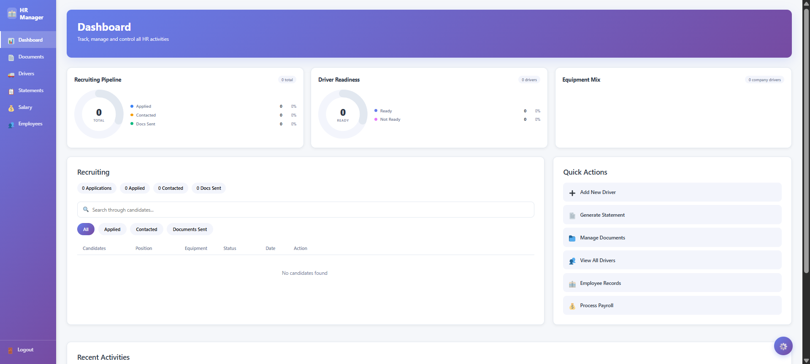

---

## 📸 Screenshots

### Landing Page
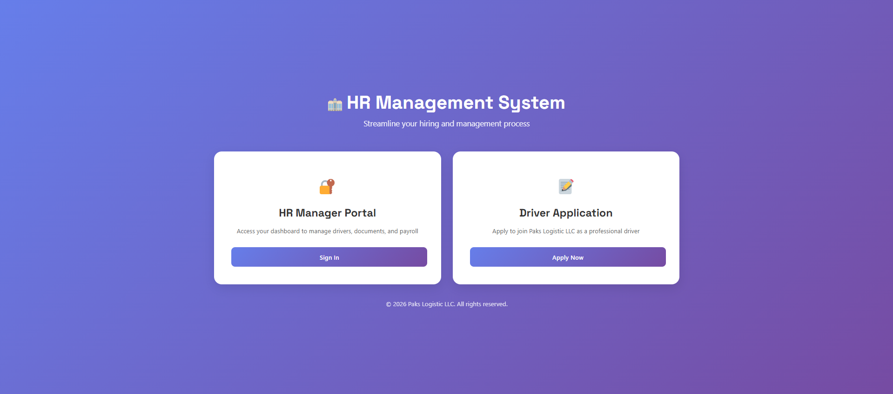
> The public-facing entry point. Candidates can apply for a driver position or staff can log in to the HR portal.

---

### Login

> Secure login with role detection — Admin and Accounting users see different dashboards after signing in.

---

### Dashboard (Admin)

> Overview of the recruiting pipeline, driver readiness stats, equipment mix charts, and recent activity feed.

---

### Dashboard (Accounting)
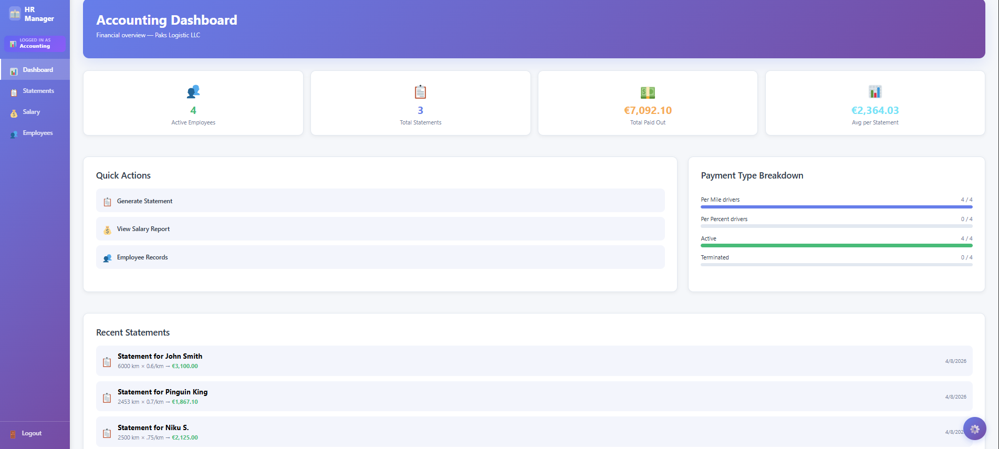
> Simplified view for the accounting role — focused on salary statements and financial activity.

---

### Driver Application Form (Public)
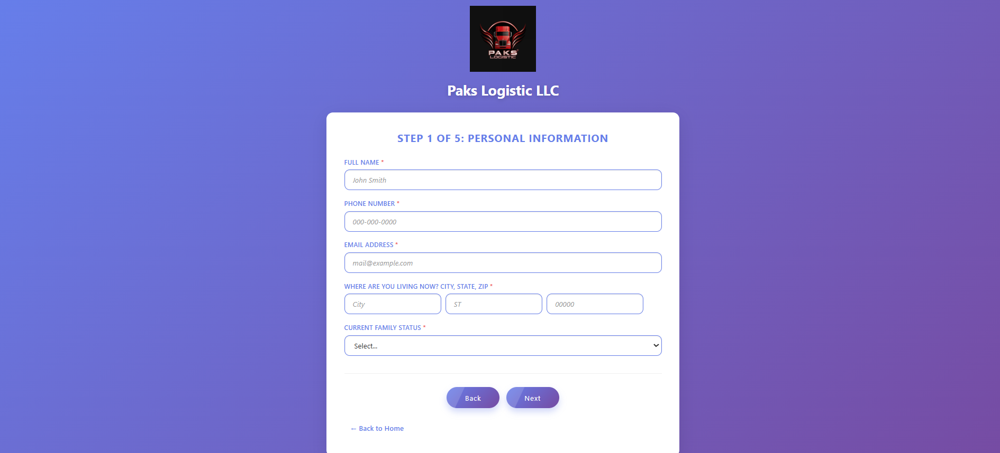
> Multi-step form accessible without login. Candidates fill in personal info, driving experience, work preferences, availability, and upload their CDL and medical card. Everything lands automatically in the dashboard.

---

### Recruiting / Documents
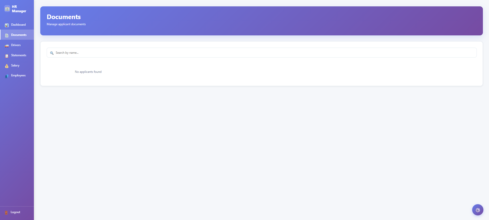
> Manage applicant documents — CDL certificate, medical card and the filled-in application PDF. Once documents are in order, hire the applicant with one click and they move straight to Drivers.

---

### Drivers
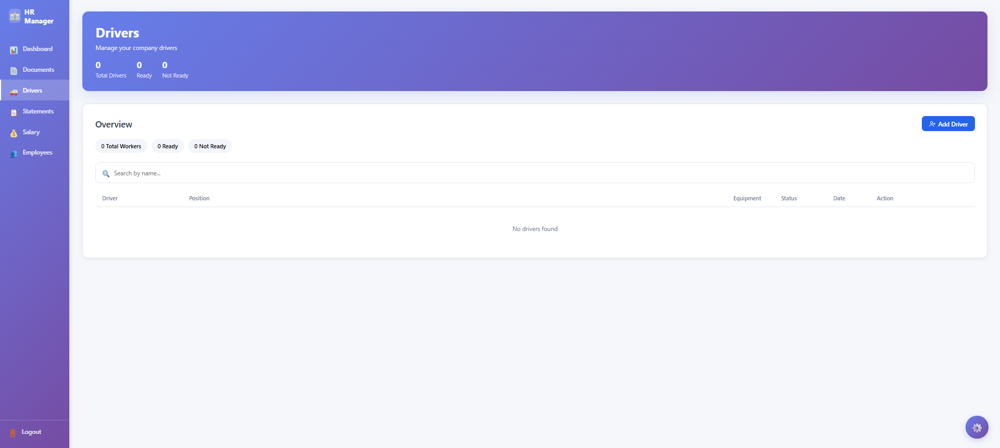
> Full list of active drivers. Add drivers manually, toggle Ready/Not Ready status, view their documents or terminate them.

---

### Add Driver
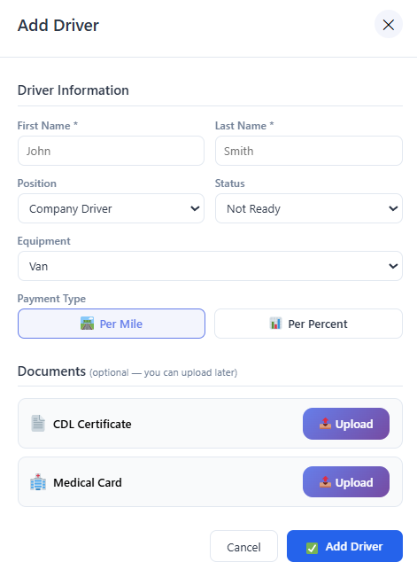
> Manually add a new driver from the Drivers page — fill in name, position, equipment and
> payment type, and optionally upload their CDL and medical card right away.

---

### Employees
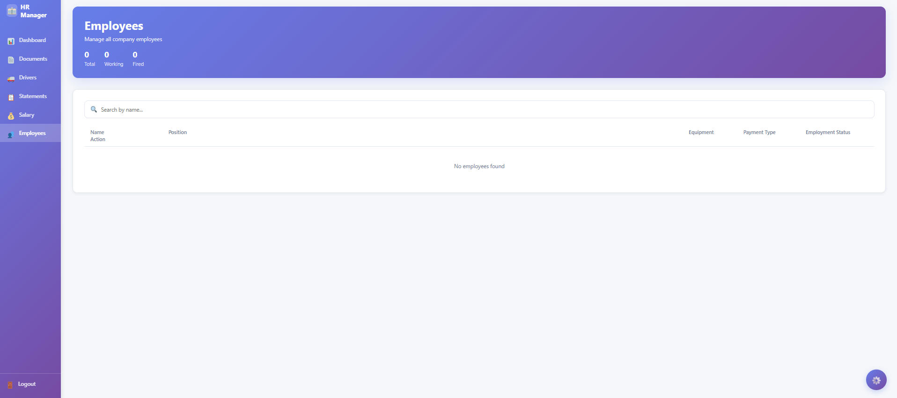
> Detailed employee records — change equipment type, add internal notes (truck number, trailer, phone), and view linked statements and documents.

---

### Salary Statements
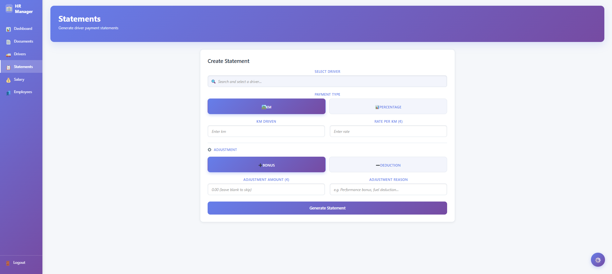
> Generate salary statements for any driver — choose per-mile or percentage-based pay, add bonuses or deductions, and download as PDF.

---

### Salary 
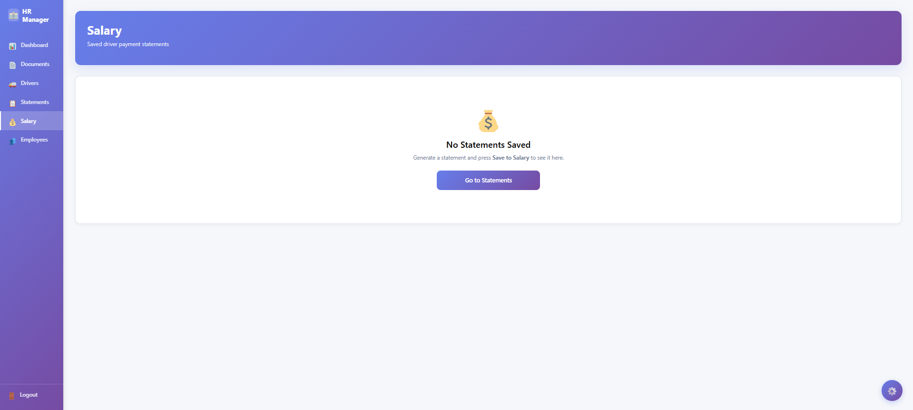
> Full payroll history with a weekly pay strip showing activity over the last 52 weeks.
> Filter by driver, view totals and download any statement as a PDF.

---

### Settings
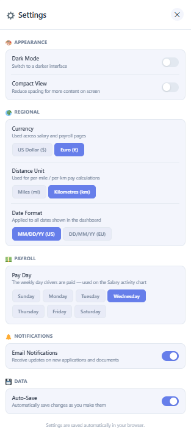
> Personalise the experience — dark/light mode, currency, distance unit (miles/km), date format and pay day.

---

## ✨ Features

- **Public application form** — multi-step form (5 steps + documents) for driver candidates, accessible without login
- **Recruiting pipeline** — track applicants through Applied → Contacted → Documents Sent → Hired
- **Document management** — upload and store CDL certificates, medical cards, working contracts and application PDFs per driver
- **Driver management** — add drivers manually or hire directly from applicants, toggle Ready/Not Ready status, terminate
- **Employee records** — internal notes per driver, equipment change, employment status, statements history
- **Salary statements** — calculate pay by miles or percentage, add bonuses/deductions, download PDF
- **Role-based dashboards** — Admin sees full HR view; Accounting sees statements and salary only
- **Settings** — dark mode, currency (USD/EUR), distance unit (miles/km), date format, pay day

---

## 🛠️ Tech Stack

### Frontend
| Technology | Version | Purpose |
|---|---|---|
| React | 18.2 | UI framework |
| TypeScript | 5.2 | Type safety |
| Vite | 5.0 | Build tool & dev server |
| React Router | 6.20 | Client-side routing |
| react-axios-provider-kit | 0.1.1 | Axios + JWT token management |
| Zod | 4.3 | Form validation |
| Lucide React | 0.577 | Icons |

### Backend
| Technology | Version | Purpose |
|---|---|---|
| ASP.NET Core | 8.0 | REST API framework |
| Entity Framework Core | 8.0.11 | ORM / database access |
| SQLite | — | Database (file-based) |
| BCrypt.Net-Next | 4.0.3 | Password hashing |
| JWT Bearer | 8.0.11 | Authentication |
| Swashbuckle / Swagger | 6.9 | API documentation |

---

## 🏗️ Architecture

```
Backend/
├── HRDashboard.API/           ← Controllers, Program.cs, JWT/CORS config
├── HRDashboard.BusinessLayer/ ← Business logic, interfaces, TokenService
├── HRDashboard.DataAccess/    ← EF Core DbContexts, migrations, DbSession
└── HRDashboard.Domain/        ← Entities, DTOs (data models)

Front/
└── src/
    ├── pages/                 ← LandingPage, LoginPage, Dashboard, ApplicationForm
    ├── components/
    │   ├── dashboard/         ← DashboardHome, DriversPage, DocumentsPage, EmployeesPage ...
    │   └── application/       ← Multi-step form steps (5 steps)
    ├── contexts/              ← AuthContext, SettingsContext, SavedStatementsContext
    ├── hooks/                 ← useCompanyData, useDriverDocStorage, useHealthCheck
    ├── services/              ← applicationSubmitService, applicationService
    ├── types/                 ← TypeScript interfaces
    └── utils/                 ← PDF generation utilities
```

---

## 📋 API Endpoints

| Method | Endpoint | Auth | Description |
|---|---|---|---|
| POST | `/api/auth/login` | ❌ | Login, returns JWT token |
| GET | `/api/drivers` | ✅ | Get all company drivers |
| POST | `/api/drivers` | ✅ | Add a new driver |
| PUT | `/api/drivers/{id}` | ✅ | Update driver (status, equipment, notes) |
| DELETE | `/api/drivers/{id}` | ✅ | Remove driver |
| GET | `/api/applicants` | ✅ | Get all applicants |
| POST | `/api/applicants` | ✅ | Create applicant |
| PUT | `/api/applicants/{id}/status` | ✅ | Update applicant status |
| POST | `/api/applicants/{id}/hire` | ✅ | Hire applicant → becomes driver (transfers documents) |
| GET | `/api/documents/{driverId}` | ✅ | Get documents for a driver |
| POST | `/api/documents` | ✅ | Upload document (authenticated) |
| POST | `/api/documents/public` | ❌ | Upload document (public — used by application form) |
| DELETE | `/api/documents/{id}` | ✅ | Delete document |
| GET | `/api/statements` | ✅ | Get all salary statements |
| POST | `/api/statements` | ✅ | Save a statement |
| DELETE | `/api/statements/{id}` | ✅ | Delete a statement |
| POST | `/api/applications` | ❌ | Submit driver application form (public) |
| GET | `/api/health` | ❌ | Health check |

Full interactive docs available at `https://localhost:7001/swagger` in Development mode.

---

## 🔒 Security

- Passwords stored as **BCrypt hashes** — never in plain text
- JWT key and passwords live in `appsettings.Development.json` — **excluded from Git**
- JWT tokens expire after **8 hours**
- CORS restricted to `localhost:5173` in development
- All dashboard routes require a valid, non-expired JWT token
- `appsettings.Development.json` and `*.db` database files are blocked by `.gitignore`

---

## 📄 License

Copyright © 2026 Paks Logistic LLC. All Rights Reserved.
